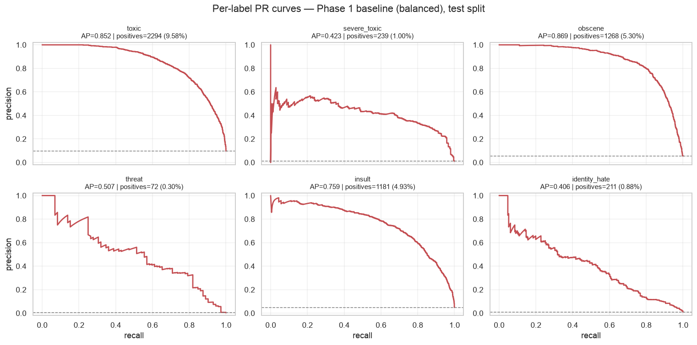
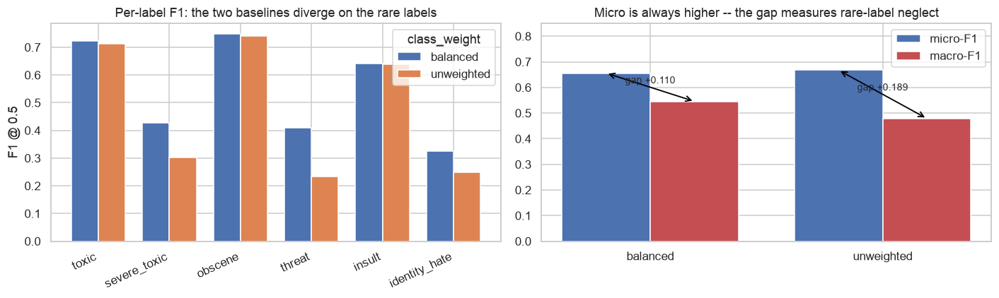
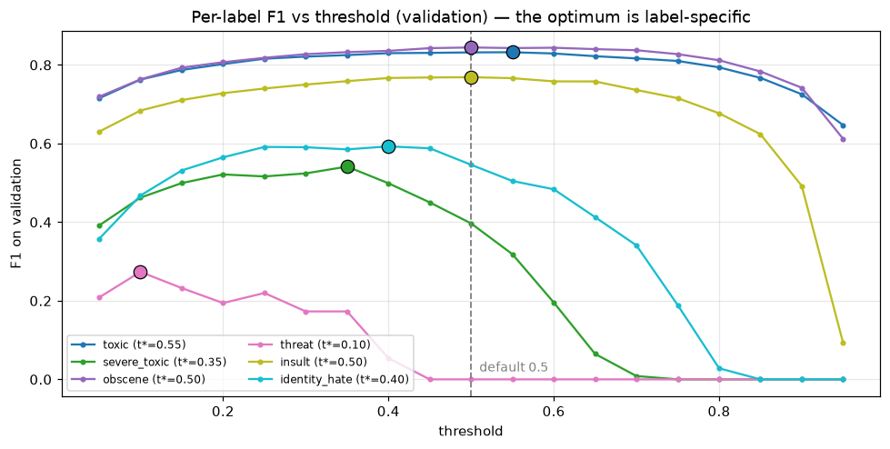
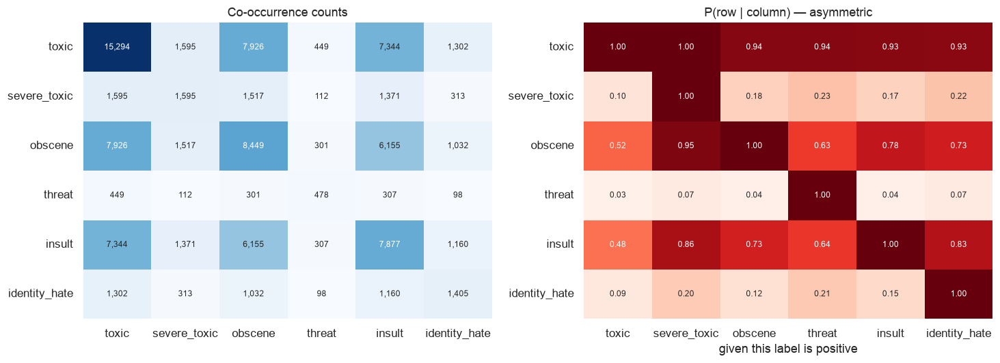

# Multi-label content / policy classification

Given a comment, predict **all** applicable policy labels — `toxic`, `severe_toxic`, `obscene`,
`threat`, `insult`, `identity_hate` — not just the most likely one. Fine-tuned DistilBERT on the
Kaggle *Jigsaw Toxic Comment Classification* data (159,571 Wikipedia comments).

The project is organised around one claim: **accuracy is the wrong metric here.** A model that
predicts *nothing at all* scores **89.83% exact-match accuracy** and **99.70% on `threat`** on
this data, at a macro-F1 of exactly **0.0**. So the work isn't squeezing the model — it's
choosing the right metric, calibrating a threshold per label, and doing real error analysis.

- **Model:** https://huggingface.co/srijanratrey/distilbert-jigsaw-multilabel
- **Live demo:** [live_demo](https://multilabel-content-classification.streamlit.app/)
- **Build brief:** [tech-spec.md](tech-spec.md)

---

## Results

Held-out test split, n=23,936. Macro-F1 is the headline; "tuned" means per-label thresholds
calibrated on **validation** and applied unchanged to test.

| model | macro-F1 @0.5 | macro-F1 tuned | micro-F1 tuned |
|---|---|---|---|
| all-zeros control | 0.0000 | — | — |
| TF-IDF + OvR logistic regression, unweighted | 0.4692 | 0.5964 | 0.7249 |
| TF-IDF + OvR logistic regression, balanced | 0.5412 | 0.6112 | 0.7235 |
| **DistilBERT** | **0.6626** | **0.6836** | 0.7875 |

Per-label, for the final model (macro-AP 0.7359, Hamming loss 0.0158):

| label | threshold | precision | recall | F1 | AP | test positives |
|---|---|---|---|---|---|---|
| `toxic` | 0.55 | 0.847 | 0.832 | **0.839** | 0.921 | 2,295 |
| `obscene` | 0.65 | 0.832 | 0.826 | **0.829** | 0.910 | 1,268 |
| `insult` | 0.50 | 0.733 | 0.787 | **0.759** | 0.832 | 1,181 |
| `identity_hate` | 0.50 | 0.667 | 0.535 | **0.594** | 0.641 | 213 |
| `severe_toxic` | 0.25 | 0.441 | 0.697 | **0.540** | 0.573 | 241 |
| `threat` | 0.20 | 0.456 | 0.662 | **0.540** | 0.538 | 71 |



---

## Quickstart

Python 3.11+ required (developed on 3.12).

```bash
git clone https://github.com/Srijan-Ratrey/Multilabel-content-classification.git
cd Multilabel-content-classification
python -m venv .venv && source .venv/bin/activate     # or: uv venv --python 3.12 .venv
pip install -r requirements.txt
```

**Data.** Download the Kaggle
[Jigsaw Toxic Comment Classification Challenge](https://www.kaggle.com/c/jigsaw-toxic-comment-classification-challenge)
files and place them in `data/raw/` (gitignored, ~140MB). Only `train.csv` is needed for the
pipeline. Then build the label matrix and freeze the splits:

```bash
python -m src.data
```

**Classify your own text** (needs a trained model — see below):

```bash
python -m src.predict --interactive
python -m src.predict "you are an idiot"
python app.py                      # Gradio UI at http://127.0.0.1:7860
```

---

## Repo layout

```
.
├── src/
│   ├── config.py          SEED=42, LABELS, paths, device selection
│   ├── data.py            cleaning, (n,6) label matrix, splits, the Kaggle -1 filter
│   ├── baseline.py        Phase 1: TF-IDF + One-vs-Rest logistic regression
│   ├── evaluate.py        Phase 2: the metric harness every phase reports through
│   ├── transformer.py     Phase 3: DistilBERT fine-tune (sigmoid + BCE)
│   ├── thresholds.py      Phase 4.1: per-label threshold calibration
│   ├── policies.py        Phase 4.2: written policy definitions
│   ├── policy.py          Phase 4.2: policy-conditioned cross-encoder
│   ├── predict.py         inference on arbitrary text
│   └── viz.py             the probability/threshold chart, shared by both UIs
├── notebooks/
│   ├── train_model.ipynb    ← self-contained training notebook (Kaggle/Colab ready)
│   ├── 01_eda.ipynb         Phase 0: label rates, co-occurrence, lengths
│   └── 02_metrics.ipynb     Phase 2: why accuracy fails, micro vs macro
├── app.py                 Gradio UI (local)
├── deploy/                Streamlit Community Cloud app + its own requirements
├── scripts/push_to_hub.py publish the model to the HF Hub
├── results/               every metric as JSON, every plot as PNG
├── data/raw/              Kaggle CSVs (gitignored)
└── models/                weights + cached probability matrices (gitignored)
```

---

## How to run the pipeline

### Training: use the notebook

[notebooks/train_model.ipynb](notebooks/train_model.ipynb) is self-contained — no `src/`
imports — so it runs on Kaggle or Colab as well as locally. It finds `train.csv` automatically
(including under `/kaggle/input`), adapts to whichever `transformers` version is installed,
trains, evaluates, calibrates thresholds, and writes every artifact the analysis reads.

Set `QUICK_TEST = True` for a ~2 minute smoke run first. Full run: **~21 min on a Kaggle T4**,
~45 min on an Apple M4 (MPS).

### Or the CLI, phase by phase

```bash
python -m src.data                                   # splits -> data/processed/splits.npz
python -m src.baseline --class-weight balanced       # Phase 1
python -m src.baseline --class-weight none           #   the unweighted contrast
python -m src.evaluate --probs models/probs/baseline_test.npy --split test \
    --out results/phase2_baseline_test.json --plots results/pr_baseline.png
python -m src.transformer --token-stats              # measure truncation cost first
python -m src.transformer                            # Phase 3
python -m src.thresholds --model transformer         # Phase 4.1
python -m src.policy --variant all                   # Phase 4.2 (not yet run)
python -m src.policy --variant heldout               #   held-out-policy probe
```

Every command writes its metrics to `results/*.json` and its plots to `results/*.png`, so
phases stay comparable.

---

## Key findings

**Accuracy is disqualified.** The all-zeros control scores 89.83% exact-match and 96.33% mean
per-label accuracy at macro-F1 0.0. Accuracy rewards predicting the majority class, and here
89.8% of comments carry no label at all. It appears in this repo only inside each result's
`all_zeros_baseline` block, as a control.

**Micro-F1 would have selected the worse model.** The unweighted baseline beats the balanced one
on micro-F1 (0.6716 vs 0.6591) while losing badly on macro-F1 (0.4692 vs 0.5412). It buys that
micro-F1 by being precise on frequent labels and nearly silent on rare ones — at threshold 0.5
it predicts `threat` just 9 times against 71 true positives. Micro pools every decision, so
`toxic`'s 2,295 positives outvote `threat`'s 71 by ~32:1; macro weights the six labels equally.



**Thresholds are worth more than they look.** Moving off 0.5 gains **+0.070 macro-F1 on the
baseline** (+12.9%) and **+0.021 on the transformer**, with no retraining. The gain is concentrated where
it matters: on the transformer, `severe_toxic` +0.085 and `threat` +0.040. The gain *shrinks* as
the model improves, which is the honest read — a better-calibrated model has less to recover at
the operating point.



**An undertrained model silently ignored its rarest label.** A first training run (lr 2e-5)
scored macro-F1 0.5671 and predicted `threat` **zero times** — F1 0.000 with AP 0.257. Raising
the learning rate to 3e-5 took it to 0.6626 with `threat` F1 0.500. Both runs reached the same
3,492 optimizer steps, so the entire difference was the learning rate, not training length.

**One-vs-Rest cannot represent the label structure.** Every label is close to a subset of
`toxic`: P(toxic | severe_toxic) = 1.000 exactly, and P(toxic | ·) ≥ 0.927 for all five others.
`obscene`↔`insult` overlap 0.781/0.728. Six independent classifiers have no mechanism for any of
this — the motivation for the classifier-chains comparison in Phase 6.



---

## Design decisions worth knowing

**Sigmoid + BCE, not softmax.** The output layer is six *independent* sigmoids trained with
`BCEWithLogitsLoss`. Softmax normalises across labels, forcing them to compete and sum to 1 —
it cannot represent a comment that is toxic *and* obscene *and* insulting, nor the all-zero case
that covers 89.8% of this dataset.

**The Jigsaw `-1` trap.** `test_labels.csv` has 153,164 rows, but **89,186 carry `-1` in every
label** — withheld from the original competition's scoring. `-1` means *unknown*, not negative;
only 63,978 rows are scoreable. Evaluating against the unfiltered file treats 89,186 unknowns as
negatives and produces meaningless metrics. The filter lives once in
[`load_kaggle_test`](src/data.py) behind assertions. The project's own train/val/test all come
from `train.csv`, so the main pipeline never touches it.

**Splits are frozen and stratified on the label combination.** 70/15/15, persisted to
`data/processed/splits.npz`. Stratifying on the exact 6-label combination is finer than
per-label stratification and needs only scikit-learn, so the CLI, the notebook, and a Kaggle run
produce identical splits. `threat` lands at 335 train / 72 val / 71 test positives.

**Thresholds are tuned on validation, never on test.** The 19-point grid is deliberately coarse:
with 72 validation positives for `threat`, a finer grid fits noise.

**Padding strategy was worth ~3x.** Median comment is 52 tokens against a 256 limit. Dynamic
padding *alone* barely helps — random batches still pad to 250.8 of 256, because a batch of 32
almost always catches one long comment. With length-grouped batching the mean batch width drops
to ~81, which is what takes the run from ~2h25m to ~45min on an M4.

---

## Limitations

- **English only, and it fails silently elsewhere.** The model scores a Hinglish death threat
  (`"tujhe jaan se maar dunga"`) at `threat=0.000` and fires no labels on any Hindi or Hinglish
  input. This is not degradation, it is silent failure — the worst error mode for a safety
  classifier. `distilbert-base-uncased` shreds Devanagari into meaningless single characters and
  maps Hinglish onto unrelated English word-pieces. **Do not deploy this on non-English content.**
- **Rare labels are weak.** F1 ≈ 0.54 on `threat` and `severe_toxic`; `identity_hate` recall is
  0.535, so it misses about half of them.
- **`threat`'s threshold rests on 72 validation positives**, so its tuned score is a noisy
  estimate — its validation-to-test F1 gap is −0.040.
- **Trained on 2018 English Wikipedia talk-page comments.** Other platforms, domains and eras
  will degrade, likely a lot.
- Inputs are truncated at 256 tokens, which cuts 6.93% of comments (17.44% of all tokens).
- **A demo, not a moderation system.** Don't make consequential decisions about people with it.

---

## Status

| Phase | State |
|---|---|
| 0 — Setup & EDA | ✅ done |
| 1 — TF-IDF + One-vs-Rest baseline | ✅ done |
| 2 — Metric design (the harness) | ✅ done |
| 3 — DistilBERT fine-tune | ✅ done |
| 4.1 — Per-label threshold calibration | ✅ done |
| 4.2 — Policy-conditioned classifier | ⬜ code written, not yet run |
| 5 — Error analysis | ⬜ not started |
| 6 — Classifier chains vs One-vs-Rest | ⬜ not started |

See the build status table in [tech-spec.md](tech-spec.md) for what each remaining phase needs.

## Reproducibility

`SEED = 42` is set for `random`, `numpy` and `torch` from one place ([src/config.py](src/config.py))
and logged on every entry point. Splits are frozen on disk and reused by every phase. Every
metric is written to `results/` as JSON so phases can be compared rather than re-derived.

Dataset: Kaggle *Jigsaw Toxic Comment Classification Challenge* (CC0, Wikipedia comments).
